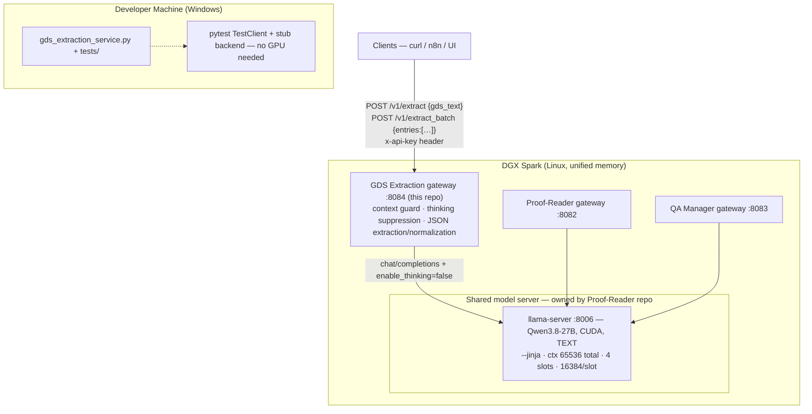

# AI GDS Extraction — Implementation Roadmap

> **Source of truth** for the Builder. Migrates Toby's API-based "GDS Extractor v3.6"
> (`make schedule`) to the shared local model server on the DGX Spark. This is the third
> gateway in the stack and MUST reuse the proven skeleton from Proof-Reader (:8082) and
> QA-Manager (:8083). Do not start implementation until every item in section 0 is honored.

---

## 0. Interrogation Decisions (locked)

| # | Question | Decision |
|---|----------|----------|
| 1 | Canonical output contract (spec pages conflict: page-1/page-3 schema vs sample result on pages 6–12) | **Sample-result superset**: nested `departure_date_time` / `arrival_date_time` objects **including `day_of_week`**, plus `originating_airport_name` / `destination_airport_name` fields, and `Passenger Name` as an **array** (up to 9 names; `["none"]` when absent). Full schema in §1.5. |
| 2 | Extraction strategy | **Pure prompt** — identical philosophy to the sibling gateways. The model computes everything from the system prompt (dates, day-of-week, durations, translations, service-class mapping); no lookup tables, no deterministic post-processing. Accuracy is enforced via prompt rules + greedy decoding + golden-case validation on the DGX. |
| 3 | Default year rule (spec says 2024 on p4, 2025 on p2/changelog v3.5.1) | **Dynamic + configurable**: `DEFAULT_YEAR` env var; code default = **current year at request time** (sentinel `__DEFAULT_YEAR__` substituted per-request, same pattern as QA-Manager's `__TODAY_DATE__`). Toby can pin it (e.g. `"2025"`) via `.env` without a code change. |
| 4 | Interface & scope | All four: single-entry endpoint at parity with siblings (`POST /v1/extract`, port **8084**), **batch endpoint** (`POST /v1/extract_batch`, sequential per-entry calls), supporting both **Amadeus availability displays** and **full reservations** (passenger names, PNR, segment record locators, class of service). |

---

## 1. Strategic Design

### 1.1 Objective

Rebuild Toby's GDS Extractor v3.6 as a lean JSON-in / JSON-out FastAPI gateway that parses
raw GDS output lines (Amadeus availability displays and complete reservations) into the
structured flight-segment JSON defined in §1.5 — running fully offline against the ONE
shared llama.cpp server already provisioned by Proof-Reader's `startserver.sh`.

Historical failure modes from Toby's changelog that this build must not regress
(these are prompt-design acceptance criteria, see §1.6):

- v1.1: reported the wrong airport (Cotabato) → airport **code is sacrosanct**; only the
  name may be translated.
- v1.2: assumed year 2023 when GDS omitted it → default-year rule must be explicit.
- v3.5/v3.6: reservation parsing (names, locators, class of service) had name-extraction
  bugs → passenger-name rules are encoded verbatim in the prompt.

### 1.2 Architecture



**Ownership boundaries (unchanged from QA-Manager v2):**
- The shared server is owned by `Proof-Reader/startserver.sh`. **No cross-repo edits are
  required for this project** — QA-Manager v2 already re-provisioned it (`--jinja`,
  ctx 65536 total, MODEL_PARALLEL=4). Phase A only *verifies* those flags still hold.
- `GDS-Extraction/` — gateway only. Never starts/kills the model.
- Port map: `8006` model · `8082` Proof-Reader · `8083` QA-Manager · **`8084` GDS Extraction**
  (reserved in QA-Manager's `.env.example` comments).

### 1.3 File layout

```
GDS-Extraction/
├── gds_extraction_service.py       # Single-file FastAPI gateway (mirrors qa_manager_service.py)
│                                   #   • config loader (.env) — defaults == .env.example
│                                   #   • pure pipeline: build_prompt / build_params /
│                                   #     estimate_tokens / check_context /
│                                   #     extract_json + _normalize_gds / run_extract /
│                                   #     run_extract_batch
│                                   #   • HTTP backend: param-degradation chain +
│                                   #     reasoning_content resolution chain
│                                   #   • FastAPI routes + lean x-api-key auth
├── start.sh                        # Bootstrap venv/.env → probe shared server health → launch gateway only
├── stop.sh                         # Gateway-only shutdown (never touches llama-server)
├── .env.example                    # Mirrors code defaults exactly (RC3 discipline)
├── requirements.txt                # fastapi, uvicorn[standard], requests, python-dotenv, pytest, httpx
├── README.md                       # Deploy order, API reference + curl examples, port map, troubleshooting
├── implementation.md               # This file
└── tests/
    ├── test_extract.py             # All pipeline/auth/guard/degradation tests (Windows, stub backend)
    └── cases/
        ├── amadeus_availability_input.txt      # Verbatim query from AI_GDS_EXTRACTION.md p6
        ├── amadeus_availability_expected.json  # Expected 10-segment result (doc pp6–12)
        └── reservation_case.json               # TODO: obtain/synthesize a full-reservation
                                                # sample + confirm expected output with Toby (§3)
```

### 1.4 API contract

**Single entry** — `POST /v1/extract` (header `x-api-key: <key>`)

```json
{ "gds_text": "<one or more lines copied from the GDS>" }
```

→ `200 OK` with exactly one schedule object (§1.5).

**Batch** — `POST /v1/extract_batch`

```json
{
  "entries": [
    { "id": "req-001", "gds_text": "…" },
    { "id": "req-002", "gds_text": "…" }
  ]
}
```

→ `200 OK`:

```json
{
  "results": [
    { "id": "req-001", "status": "ok", "schedule": { …§1.5… } },
    { "id": "req-002", "status": "error", "error": "model returned unparseable output" }
  ]
}
```

**Design decision — batch = sequential loop, NOT one mega-prompt.** Each entry gets its own
model call. Rationale: (a) preserves per-entry accuracy within the 16,384-token slot budget;
(b) isolates failures so one bad entry cannot poison others; (c) reuses the identical
single-entry pipeline verbatim. Entries processed in order; overall HTTP status is 200 even
when individual entries fail (per-entry `status` field reports it). Empty `entries` → 422.

**Parity** — `POST /v1/version` → `{ "version": "1.0" }` (no model call).
**Discovery** — `GET /` lists endpoints; `GET /healthz` probes `:8006/health` and
cross-checks the computed slot budget against `/props` per-slot `n_ctx`
(`context_check: match|MISMATCH|unknown`), exactly like QA-Manager.

**Errors**

| Status | When |
|--------|------|
| 401 | missing/unknown `x-api-key` |
| 422 | malformed body / empty required field(s) / **context-guard rejection** (actionable sizing guidance) |
| 503 | model unreachable, timeout, empty response, server-side context overflow |
| 500 | unexpected pipeline error (no internals leaked) |

### 1.5 Output schema (canonical — locked by decision #1)

```json
{
  "Record type": "reservation",
  "Passenger Name": ["SMITH/JOHN MR", "APDI/CORP TRAVEL"],
  "PNR": "ABC123",
  "segments": [
    {
      "segment_number": 1,
      "segment_record_locator": "XYZ789",
      "airline_code": "PR",
      "airline_name": "Philippine Airlines",
      "flight_number": 221,
      "originating_airport_code": "MNL",
      "originating_airport_name": "Ninoy Aquino International Airport",
      "originating_terminal": "1",
      "destination_airport_code": "BNE",
      "destination_airport_name": "Brisbane Airport",
      "destination_terminal": "International",
      "departure_date_time": {
        "month": 9,
        "month_name": "September",
        "date": 3,
        "year": 2025,
        "day_of_week": "Wednesday",
        "time": "23:45"
      },
      "arrival_date_time": {
        "month": 9,
        "month_name": "September",
        "date": 4,
        "year": 2025,
        "day_of_week": "Thursday",
        "time": "09:30"
      },
      "flight_duration": "07:45",
      "aircraft_type": "Airbus A321",
      "service_class_letter": "M",
      "service_class": "Economy"
    }
  ]
}
```

Field rules (from spec + sample):
- `Record type`: `"reservation"` if record locator(s) AND passenger name(s) present, else `"none"`.
- `Passenger Name`: array of ALL passengers (up to 9), original `Lastname/Firstname(s)` format
  preserved; `["none"]` when not a reservation.
- `PNR`: first PNR in the record (NOT segment PNRs); `"none"` otherwise.
- Availability display (non-reservation): `Passenger Name: ["none"]`, `PNR: "none"`,
  `segment_record_locator: "none"`, `service_class_letter: "none"`, `service_class: "none"`
  (availability counts like `J5 C5 D5` are NOT class of service for the traveler).
- `_airport_name` fields: translated full airport names; the 3-letter codes themselves are
  sacrosanct and copied verbatim.
- Terminals: `"none"` when absent from the GDS line.
- Times: military `HH:MM`; `+N` arrival-day offsets resolved into the correct
  date/day_of_week/month/year (incl. month and year rollovers).
- `flight_duration`: `"HH:MM"` as shown in the doc's expected output.

### 1.6 Prompt design (system prompt encodes the full spec)

Structure mirrors QA-Manager: static system prompt + sentinel substitution +
delimited user payload (injection-bleed reduction). Sentinels:
`__DEFAULT_YEAR__` (decision #3). User message wraps input as
`<<<GDS_DATA>>>…<<<END_GDS_DATA>>>`.

The system prompt MUST encode, verbatim-faithful to `AI_GDS_EXTRACTION.md`:

1. Task: parse GDS data → ONLY the JSON object of §1.5; no commentary/markdown outside JSON.
2. Record-type logic (reservation vs none) incl. the PNR-first-in-record rule.
3. Passenger extraction algorithm (p4–5): start after numerical passenger number; preserve
   prefixes; keep original `Lastname/Firstname(s)` format; include trailing characters after
   the locator digits; extract EVERY name (up to 9); **APDI-prefix last names keep the whole
   APDI… name intact** while other names are listed normally.
4. Segment field list incl. terminal `"none"` fallbacks.
5. PAL service-class mapping: Business = C,D,I,J,Z; Premium = N,W; Economy = all others
   (**B is explicitly Economy**); other airlines: report letter with no mapping changes.
6. Date/time rules: military HH:MM; resolve `+N` day-offsets; compute day_of_week;
   default year = `__DEFAULT_YEAR__` when absent.
7. Airport translation: only names translate; codes never change; choose the correct city
   (anti-Cotabato rule: when ambiguous, prefer the airport matching the code exactly).
8. Aircraft codes → human-readable types (e.g., 321 → Airbus A321, 333 → Airbus A330-300,
   359 → Airbus A350-900, 7M8 → Boeing 737 MAX 8); follow the sample's naming style.
9. Segment record locator rules: 6 characters following `DCPR` for Philippine Airlines;
   near end of segment data for Cebu Pacific; `"none"` unless reservation.
10. Codeshare handling per the sample: `FJ:QF3873` is emitted as QF flight 3873 (marketing
    code wins, matching Toby's expected output).
11. Output contract reminder: exact §1.5 key names/ordering-insensitive but spelling-exact;
    `segments` array always present (possibly empty if truly no segments parseable).

Sampling: `temperature 0.0` (greedy — factual extraction determinism, same rationale as
QA-Manager v2 which validated byte-identical repeats on-DGX), `top_p 0.5`, `top_k 40`,
`min_p 0`, `repetition_penalty 1.0`, `presence_penalty 0`.

### 1.7 Pipeline mechanics (carried over from QA-Manager v2)

- **Context guard**: `estimate_tokens = ceil(len/3)`; slot budget `CONTEXT_SIZE // MODEL_PARALLEL`;
  usable room = budget − `MODEL_MAX_TOKENS` − 256 margin; `CONTEXT_GUARD=strict|warn|off`
  (strict → 422 with actionable sizing guidance before any network call).
- **Thinking suppression degradation chain**: level 0 sends `reasoning_effort: 0` +
  `chat_template_kwargs {"enable_thinking": false}`; on a 400 naming a rejected field drop it
  and retry (level 1 drops chat_template_kwargs, level 2 also drops reasoning_effort);
  working level cached module-wide.
- **Content resolution chain**: `content` → `reasoning_content` → `thinking` → `reasoning` →
  `reason`; loud warning when thinking leaked.
- **extract_json() + _normalize_gds()**: strip think blocks/fences/preamble, locate JSON span,
  then normalize to the §1.5 schema: coerce types (`segment_number`/`flight_number`/month/date/
  year → int), default missing optional strings to `"none"`, guarantee `segments` is a list,
  guarantee each date-time object has all six keys. Normalization NEVER invents data — unknown
  keys are dropped, missing values become documented defaults.
- **Fail closed**: if no parseable JSON emerges, raise `ModelUnavailable` → 503
  ("unparseable model output"). Rationale: unlike QA differences (where wrapping raw text
  degrades gracefully), a fabricated or malformed schedule is dangerous downstream travel
  data. Single-entry callers get a clean 503; batch callers get a per-entry error object.

### 1.8 Constraints & sizing

- Hardware: DGX Spark, Linux; dev host Windows — shell scripts authored but never executed
  locally; only Python/pytest runs on Windows.
- Gateway `.env` must mirror server flags: `CONTEXT_SIZE=65536`, `MODEL_PARALLEL=4`
  (16,384 tokens/slot). No server-side changes planned; VERIFY only (Phase E).
- `MODEL_MAX_TOKENS` default raised to **8192** (vs siblings' 2048–4096): the golden sample
  alone produces ~10 segments ≈ 4k+ output tokens; headroom is cheap insurance against
  truncation mid-JSON. Consequence: prompt room = 16384 − 8192 − 256 = **7,934 tokens**
  (~23.8k chars of GDS text) — ample for availability displays; the guard catches outliers.
  Tuning matrix goes in the README (lower max_tokens → more prompt room, and vice versa).
- `REQUEST_TIMEOUT` default **300 s** per entry (shared slots infer slowly; batch requests
  multiply — document client timeout guidance in README).
- Lean scope: no billing/quota/async queue/metrics/uploads. Optional future hardening (out of
  scope): llama.cpp `response_format: json_schema` grammar-constrained decode.

### 1.9 Edge cases

| Case | Handling |
|------|----------|
| Availability display (no names/PNR) | `Record type "none"`, `["none"]`, `"none"` PNR/locators/class per §1.5. |
| Missing year anywhere in entry | `__DEFAULT_YEAR__` (env-configurable, runtime current year). |
| `+1`/`+2` arrival offsets | Correct arrival date/day_of_week; month rollover (Aug 31→Sep 1); year rollover (Dec 31→Jan 1, year+1). |
| Ambiguous/duplicate city names | Code sacrosanct; name chosen strictly by exact IATA match. |
| Codeshares (`FJ:QF3873`) | Marketing-code emission per golden sample. |
| Up to 9 passengers | Every name extracted; APDI-prefixed names kept intact. |
| Missing terminals | `"none"`. |
| Over-budget prompt | Guard strict → 422 pre-flight with sizing guidance; never silent truncation. |
| Unparseable model output | Fail closed → 503 (single) / per-entry `status:"error"` (batch). Never fabricate schedules. |
| Batch with some bad entries | Isolated per-entry errors; good entries unaffected; overall 200. |
| Server rejects suppression params | Degradation chain retries; working level cached. |
| Budget mismatch vs server | `/healthz` reports `context_check: MISMATCH`. |
| Model unreachable / timeout | `503`, no stack traces leaked. |
| Invalid `x-api-key` | `401` immediately. |

---

## 2. Execution Roadmap

Ordered by dependency. `VERIFY` items run on the DGX.

### Phase A — Scaffold & server verification (no cross-repo edits)
- [ ] Create repo skeleton at `E:\Projects\GDS-Extraction`: `.gitignore`, `.vscode/`,
      `requirements.txt` (fastapi, uvicorn[standard], requests, python-dotenv, pytest, httpx),
      empty `tests/` + `tests/cases/`.
- [ ] Write `.env.example`: defaults EXACTLY equal to the code constants written in Phase B —
      `MODEL_URL="http://127.0.0.1:8006/v1/chat/completions"`, `MODEL_NAME="Qwen3.8-27B"`,
      `CONTEXT_SIZE="65536"`, `MODEL_PARALLEL="4"`, `MODEL_MAX_TOKENS="8192"`,
      `LLAMA_SERVER_API_KEY="sk-internal-proofreader"`, sampling block (temp 0.0/top_p 0.5/
      top_k 40), `DISABLE_THINKING="1"`, `REQUEST_TIMEOUT="300"`, `CONTEXT_GUARD="strict"`,
      `DEFAULT_YEAR=""` (empty = runtime current year; pinning example commented),
      `API_PORT="8084"`, `API_HOST="0.0.0.0"`, `API_KEY_AUTH_HEADER="x-api-key"`,
      `API_KEYS="gds_key_0000:GDS Extraction Local Testing"`.
- [ ] Author `start.sh` (bootstrap venv/.env → wait for `:8006/health` → launch uvicorn
      gateway :8084) and `stop.sh` (gateway-only kill) modeled on QA-Manager's scripts.
- [ ] **VERIFY** on DGX: shared server still launched with `--jinja`, total ctx 65536,
      parallel 4 (startup log shows `16384 tokens/slot`); memory headroom OK. If drift is
      found, STOP and report back to the Architect (invalidates guard sizing).

### Phase B — Pure pipeline core (Windows-testable)
- [ ] Config block reading `.env` with constants matching `.env.example` byte-for-byte.
- [ ] `build_prompt(gds_text, default_year)` → system prompt encoding ALL §1.6 rules with
      `__DEFAULT_YEAR__` substituted; user message delimited `<<<GDS_DATA>>>…<<<END_GDS_DATA>>>`.
- [ ] `build_params(level)` + `_params_at_level()` degradation chain (levels 0/1/2), gated by
      `DISABLE_THINKING`.
- [ ] `estimate_tokens` / `slot_budget` / `usable_prompt_room` / `check_context` honoring
      `CONTEXT_GUARD` (raise `ContextGuardExceeded` with actionable guidance text).
- [ ] `extract_json(raw)` (think-block stripping, fence removal, span location) +
      `_normalize_gds(data)` enforcing §1.5 (type coercion, `"none"` defaults, guaranteed
      `segments` list and six date-time keys each).
- [ ] `run_extract(request, default_year, model_call)` — validate non-empty string → guard →
      prompt/params → `model_call(messages, params)` → `extract_json` → `_normalize_gds`.
- [ ] `run_extract_batch(entries, default_year, model_call)` — sequential per-entry loop with
      try/except isolation producing `{"id", "status", "schedule"|"error"}` items.

### Phase C — HTTP backend + FastAPI app
- [ ] `http_model_call(messages, params)` with the degradation retry chain, content-resolution
      fallback chain, context-overflow body detection → `ContextExceeded`, connection/timeout
      → `ModelUnavailable`.
- [ ] Pydantic models: `ExtractRequest(gds_text)`, `BatchEntry(id, gds_text)`,
      `BatchRequest(entries[min_length=1])`; lean `x-api-key` dependency (in-memory DB from
      `.env` → 401).
- [ ] Routes: `POST /v1/extract`, `POST /v1/extract_batch`, `POST /v1/version`, `GET /`,
      `GET /healthz` (probes `/health` + `/props` slot cross-check, `match|MISMATCH|unknown`).
      Map: ValueError/`ContextGuardExceeded` → 422; `ModelUnavailable`/`ContextExceeded` → 503;
      unexpected → 500 (no internals).
- [ ] Standalone runner block with startup logs (slot budget, guard mode, DEFAULT_YEAR mode).

### Phase D — Tests (Windows, stub backend)
- [ ] Prompt-shape tests: sentinels substituted, delimiters present, all rule blocks present.
- [ ] Params/degradation: level dicts correct; simulated 400s descend levels; working level cached.
- [ ] Guard boundaries: exactly-at-budget passes; +1 raises; `warn`/`off` don't raise.
- [ ] `extract_json` matrix: clean JSON, fenced, think-wrapped, preamble-wrapped, garbage → fail-closed exception.
- [ ] `_normalize_gds` matrix: string→int coercion; missing optionals → `"none"`; missing segments → `[]`;
      date-time key completion; junk keys dropped.
- [ ] `run_extract` contract + auth 401 + 422 (guard) + 503 (unavailable/unparseable) paths.
- [ ] Batch: mixed success/failure isolation; empty entries → 422; order preserved.
- [ ] Golden plumbing test: stub returns the documented expected JSON for the Amadeus sample →
      passes through normalization unchanged (value correctness itself is verified on-DGX).
- [ ] Defaults-sync test: parse `.env.example`, assert every value equals the module constant.
- [ ] Run `pytest -v` → all green.

### Phase E — Integration & verification (DGX Spark)
- [ ] Confirm Phase-A server flags; `./start.sh`; `/healthz` green with `context_check: match`.
- [ ] Smoke test: `amadeus_availability_input.txt` via curl → compare response field-by-field
      against `amadeus_availability_expected.json` (10 segments; spot-check the trap fields:
      BNE/NAN/SYD names not Cotabato; year 2025; `+1` arrivals; durations `07:45`/`03:35`;
      QF3873/QF3869 codeshare emission; class `"none"` throughout).
- [ ] Determinism: repeat smoke test ×3 at temp 0.0 → byte-identical outputs.
- [ ] Reservation case: obtain/build a full-reservation sample (names incl. an APDI entry,
      PNR, DCPR locators, PAL classes) → verify §1.5 reservation behaviors. **Confirm expected
      output with Toby** (no authoritative sample exists in the source docs).
- [ ] Batch VERIFY: ≥3 entries incl. one deliberately malformed → isolated error, others succeed.
- [ ] Guard VERIFY: temporarily set `CONTEXT_SIZE=8192` in gateway `.env` → oversized input
      yields 422 with sizing guidance; restore.
- [ ] Concurrency sanity: fire proofread (:8082) + analyze (:8083) + extract (:8084)
      simultaneously → all succeed on the shared server.
- [ ] Latency note: record per-entry extraction time at current load for the README.

### Phase F — Docs & hand-off
- [ ] `README.md`: objective, deploy order (server already running → start.sh), port map,
      API reference + curl examples (single/batch/version/healthz), sizing matrix
      (max_tokens ↔ prompt-room trade-off), troubleshooting (guard 422, MISMATCH health,
      thinking leaks, unparseable-output 503s → consider raising ctx or enabling
      json_schema hardening later).
- [ ] Commit repo; final review of this file vs code; flag deviations back to the Architect.

---

## 3. Acceptance Criteria (definition of done)

- [ ] `pytest -v` fully green on Windows, including defaults-sync test.
- [ ] On the DGX, the documented Amadeus availability sample returns the expected 10-segment
      JSON matching §1.5 — including the historical regression traps (correct airport names,
      default year 2025, `+1` date rollovers, timezone-aware durations, codeshare handling).
- [ ] A full-reservation sample (confirmed with Toby) yields correct passenger-name array,
      PNR, per-segment locators, and PAL-mapped service classes.
- [ ] Batch endpoint isolates failures; good entries never lost to bad ones.
- [ ] temp 0.0 repeatability: identical output across repeated runs.
- [ ] Over-budget input → 422 with actionable guidance; never a hang or opaque 503.
- [ ] Unparseable model output → fail-closed 503 / per-entry error; no fabricated schedules.
- [ ] `/healthz` green with `context_check: match`; sibling gateways unaffected
      (concurrent three-way smoke passes).
- [ ] No thinking tokens, preamble, or markdown leak into any response.
- [ ] README lets Toby operate the gateway without help.
