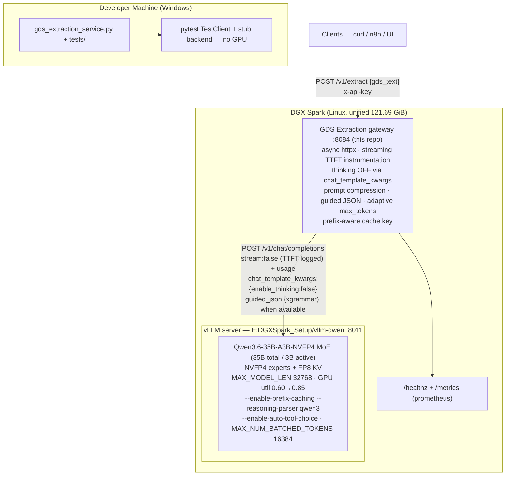

# AI GDS Extraction — Implementation Roadmap (vLLM Performance Fix)

> **Source of truth** for the Builder. This is a **performance-correction** roadmap that
> replaces the v1.0 llama.cpp assumptions (65536 / 4 slots / 8192 max_tokens / sync requests)
> with a vLLM-native design targeting **p50 <60s (stretch <30s)** on the DGX Spark.
> Do not start implementation until §0 is honored.

---

## 0. Interrogation Decisions (locked)

| # | Question | Decision |
|---|----------|----------|
| 1 | Canonical output contract (spec pages conflict: page-1/page-3 schema vs sample result on pages 6–12) | **Sample-result superset**: nested `departure_date_time` / `arrival_date_time` objects **including `day_of_week`**, plus `originating_airport_name` / `destination_airport_name` fields, and `Passenger Name` as an **array** (up to 9 names; `["none"]` when absent). Full schema in §1.5. |
| 2 | Extraction strategy | **Pure prompt** — identical philosophy to the sibling gateways. The model computes everything from the system prompt (dates, day-of-week, durations, translations, service-class mapping); no lookup tables, no deterministic post-processing. Accuracy is enforced via prompt rules + greedy decoding + golden-case validation on the DGX. |
| 3 | Default year rule (spec says 2024 on p4, 2025 on p2/changelog v3.5.1) | **Dynamic + configurable**: `DEFAULT_YEAR` env var; code default = **current year at request time** (sentinel `__DEFAULT_YEAR__` substituted per-request, same pattern as QA-Manager's `__TODAY_DATE__`). Toby can pin it (e.g. `"2025"`) via `.env` without a code change. |
| 4 | Interface & scope | All four: single-entry endpoint at parity with siblings (`POST /v1/extract`, port **8084**), **batch endpoint** (`POST /v1/extract_batch`, sequential per-entry calls), supporting both **Amadeus availability displays** and **full reservations** (passenger names, PNR, segment record locators, class of service). |
| 5 | **NEW — vLLM migration performance root cause (2026-08-27)** | **Measured 103s for 2-segment Toby test** (`RP/MNLPH21GN CRUZ/ROWELL ...` — `wc -c 1523` sanitized JSON). vLLM log shows `gen 68 tok/s sustained for ~90s, prompt 122 tok/s, GPU KV 0.2%, prefix hit 0.0%` → model emitted **~6-7k tokens** for a payload that needs **~400-600 tokens**. Same latency as llama.cpp Q5 proves the bottleneck moved from dense-vs-MoE to **prompt+decoding overhead**, not model size. Decisions in §1.2/1.8 are locked to fix this without sacrificing accuracy. |

---

## 1. Strategic Design

### 1.1 Objective

Deliver the same GDS Extractor v3.6 contract (§1.5) but with **predictable sub-60s latency** on the **vLLM Qwen3.6-35B-A3B-NVFP4** server at `E:\DGXSpark_Setup\vllm-qwen` (port `8011`). The user migrated
`llama.cpp Qwen3.8-27B Q5 GGUF dense (8006)` → `vLLM Qwen3.6-35B-A3B NVFP4 MoE (8011)` expecting throughput gain and observed **none**: `~120s` before and after. The goal is not to chase micros — it is to **remove the three proven overheads** (thinking trace, over-reserved decode, blocking gateway) and to **align gateway assumptions with the vLLM engine** so the MoE's `3B active` advantage actually materializes.

Success = the Toby fixture (`/tmp/gds_toby2.txt`, 2 segments) returns `200` in **<60s p50, <75s p95** on an idle Spark, and the 10-segment golden sample (`tests/cases/amadeus_availability_input.txt`) returns in **<60s p50** as well. Stretch goal `<30s` for the 2-segment case once prefix caching + guided JSON land.

### 1.2 Root-Cause Analysis (evidence from this machine)

| Symptom | Evidence | Interpretation |
|---|---|---|
| **A — Token bloat dominates wall time** | `time curl ... /v1/extract` → `1523 bytes` in `103s`; vLLM engine log `Avg generation throughput: 68-69 tok/s` for 10 consecutive 10s windows (`Running: 1 reqs, GPU KV 0.2-0.3%`) → `68 tok/s × 103s ≈ 7k tokens` generated for ~500-token ideal output. Prompt throughput only `122 tok/s` for the first window then `0` (prefill done in ~1 prefill window). | Generation length, not prefill, is the cost center. At 68 tok/s, **cutting 7k → 1.5k tokens saves ~80s**. |
| **B — Thinking not effectively suppressed** | `gds_extraction_service.py` sends `reasoning_effort:0` + `chat_template_kwargs:{enable_thinking:false}` via llama.cpp-style degradation chain. `E:\DGXSpark_Setup\vllm-qwen\startserver.sh` launches vLLM with `--reasoning-parser qwen3 --tool-call-parser qwen3_xml --enable-prefix-caching --trust-remote-code` — a reasoning model. vLLM's OpenAI path *does* honor top-level `chat_template_kwargs` (see `benchmark_load.py` line 142: `payload["chat_template_kwargs"] = {"enable_thinking": False}`) but the gateway's `DISABLE_THINKING` path still goes through a 3-level retry that first sends `reasoning_effort` (unknown to vLLM) and `chat_template_kwargs`. The log shows `200 OK` on first try (no rejection), so the flag *was* sent, yet the 7k token count strongly suggests a hidden `<think>` trace was still generated and counted toward throughput (benchmark.py tracks `reasoning_s = ttft_content - ttft` for this exact reason). `Prefix cache hit rate: 0.0%` also hints the template with/without thinking toggles the prefix identity. | If thinking truly OFF, the 2-segment payload should decode in `500 tok / 68 tok/s ≈ 7s + prefill`. **We must prove OFF is honored** by measuring `usage.completion_tokens` split into `reasoning_tokens` vs `content tokens` and by instrumenting `reasoning_content` length. |
| **C — Over-reserved decode budget** | `.env.example` + `gds_extraction_service.py` default `MODEL_MAX_TOKENS=8192` (`prompt room = 16384-8192-256=7936` on the stale slot math). Golden 10-segment sample needs `~3500 tokens`; Toby 2-segment needs `~600 tokens`. `8192` lets the model run away to its cap when EOS is weak, and forces vLLM's scheduler to reserve a large output slot (`MAX_MODEL_LEN=32768` → `MAX_NUM_BATCHED_TOKENS=16384` already; large per-request reservation limits batch throughput). | Cap must be **tight + dynamic**: e.g. `max_tokens = min(2500 + 250*segments_hint, 4096)` or at least lower default to `2048-3072` with a per-request override for the 10-segment case. |
| **D — Blocking gateway nullifies vLLM concurrency** | `gds_extraction_service.py:599 http_model_call` uses `requests.post(..., timeout=300)` inside `async def extract`. FastAPI event loop blocks for the full 103s — no streaming, no `httpx.AsyncClient`, no `stream=True`, no observability of TTFT. `run_extract_batch` is a sequential `for` loop. vLLM can do continuous batching (`MAX_NUM_SEQS=256`) but gateway serializes everything. | Move to async + streaming to expose TTFT, allow concurrent requests, and let vLLM actually batch. |
| **E — Stale sizing contract hides the real engine** | `start.sh` now defaults to `MODEL_URL=http://127.0.0.1:8011/v1/chat/completions` with warning if `:8006` is used, but `.env.example` and `gds_extraction_service.py` defaults still say `8006 / Qwen3.8-27B / CONTEXT_SIZE=65536 / MODEL_PARALLEL=4` (llama slot math). `vllm-qwen/startserver.sh` actuals: `MAX_MODEL_LEN=32768, GPU_MEMORY_UTILIZATION=0.60, KV_CACHE_DTYPE=fp8, MAX_NUM_BATCHED_TOKENS=16384, MAX_NUM_SEQS=256, --enable-prefix-caching`. Gateway's `slot_budget() = CONTEXT_SIZE // MODEL_PARALLEL` → `16384` (coincidentally close to vLLM's `MAX_NUM_BATCHED_TOKENS`), but the guard message + `/healthz` check still reference `n_ctx` slots and `/props` which vLLM does not expose the same way. `Prefix cache hit rate 0.0%` suggests we cannot yet rely on it. | Align `.env.example` + code defaults + README + `/healthz` to vLLM reality: `8011 / Qwen3.6-35B-A3B-NVFP4 / CONTEXT_SIZE=32768 / MODEL_PARALLEL=1` (no slots). `MODEL_MAX_TOKENS` default `3072` (not `8192`). `LLAMA_SERVER_API_KEY` optional (vLLM `API_KEY` empty by default). |

**Net:** The engine *is* fast (`68 tok/s` is healthy for NVFP4 on Spark unified memory; `GPU KV 0.2%` proves not memory-bound; `122 tok/s` prompt proves prefill is fine). The fix is **stop generating 7k tokens synchronously behind a stale contract**, not a bigger GPU.

### 1.3 Architecture (vLLM-native)



**Ownership boundaries (updated):**
- Model engine is owned by `E:\DGXSpark_Setup\vllm-qwen\startserver.sh` (`:8011`, vLLM MAIN). This repo **never** starts/kills it; `start.sh` only probes `/health` + `/v1/models` (fallback) and `MODEL_URL`.
- `GDS-Extraction/` remains gateway-only. Port map: `8011` vLLM Qwen3.6 · `8084` gateway (unchanged). Legacy `8006` llama.cpp is deprecated and only mentioned in troubleshooting.
- Prefix caching is an engine feature (`--enable-prefix-caching` already on). Gateway's job is to **make it hit**: keep `system` prompt byte-identical across requests (same `DEFAULT_YEAR` pinning strategy) and avoid varying `chat_template_kwargs` per-request after the first successful level is cached.

### 1.4 File layout (no new top-level files; changes are in-place)

```
GDS-Extraction/
├── gds_extraction_service.py       # MAJOR EDITS: async http backend, vLLM-native params, prompt compression, guided JSON, metrics
├── start.sh                        # already vLLM-aware (8011 default, SERVER_WAIT 900, /health + /v1/models probe) — keep, add .env regeneration hint
├── stop.sh                         # unchanged (gateway-only)
├── .env.example                    # MUST be updated to vLLM reality (see §1.8)
├── requirements.txt                # add httpx, xgrammar client hint not required; keep fastapi/uvicorn/requests/dotenv/pytest/httpx
├── README.md                       # updated deploy order, port map, sizing matrix, troubleshooting for vLLM
├── implementation.md               # this file
└── tests/
    ├── test_extract.py             # extended: async, guided JSON, max_tokens cap, defaults-sync
    └── cases/
        ├── amadeus_availability_input.txt
        ├── amadeus_availability_expected.json
        └── reservation_case.json
E:\DGXSpark_Setup\vllm-qwen\
├── startserver.sh                  # owned there — document recommended tuning for GDS workload (no code change here unless owner consents)
├── benchmark.py / benchmark_load.py # reference for streaming TTFT instrumentation to copy
```

### 1.5 Output schema (canonical — unchanged from v1.0)

```json
{
  "Record type": "reservation",
  "Passenger Name": ["SMITH/JOHN MR", "APDI/CORP TRAVEL"],
  "PNR": "ABC123",
  "segments": [
    {
      "segment_number": 1,
      "segment_record_locator": "XYZ789",
      "airline_code": "PR",
      "airline_name": "Philippine Airlines",
      "flight_number": 221,
      "originating_airport_code": "MNL",
      "originating_airport_name": "Ninoy Aquino International Airport",
      "originating_terminal": "1",
      "destination_airport_code": "BNE",
      "destination_airport_name": "Brisbane Airport",
      "destination_terminal": "International",
      "departure_date_time": {"month": 9, "month_name": "September", "date": 3, "year": 2025, "day_of_week": "Wednesday", "time": "23:45"},
      "arrival_date_time": {"month": 9, "month_name": "September", "date": 4, "year": 2025, "day_of_week": "Thursday", "time": "09:30"},
      "flight_duration": "07:45",
      "aircraft_type": "Airbus A321",
      "service_class_letter": "M",
      "service_class": "Economy"
    }
  ]
}
```

Field rules verbatim from v1.0 (Record type, Passenger Name up to 9 + APDI, PNR first-in-record, availability `none` sentinels, airport codes sacrosanct, terminals `none`, day-of-week + `+N` rollovers, `flight_duration`, aircraft types, PAL `C,D,I,J,Z` Business / `N,W` Premium / else Economy incl. `B`, `DCPR` locator, codeshare `FJ:QF3873 → QF 3873`).

### 1.6 Prompt design (compress but preserve all §1.5 rules)

Current `GDS_SYSTEM` is correct but verbose (~1100 tokens). Keep every rule (§1.6 v1.0 items 1-11) but **compress**:

- Merge airline/aircraft tables into a single auto-detect clause; move full IATA expansion note to a one-line directive.
- Shorten date/time section: keep `+N` + month/year rollover + `day_of_week` computation but remove example sentences; add explicit `Output exactly one JSON object, no code fences`.
- Add a **negative instruction**: `Do not emit <think>, reasoning, explanations, or markdown. Output JSON only.`.
- Keep sentinel `__DEFAULT_YEAR__` substitution (system prompt stays prefix-cacheable — year is pinned per gateway lifetime, not per-request; see `resolve_default_year()` caching).
- User delimiter stays `<<<GDS_DATA>>>…<<<END_GDS_DATA>>>`.

**Token budget target:** system prompt `<750 tokens` (down from ~1100). Measure via `len(system)//3 + tiktoken` and assert in tests. Shorter prefix directly improves `prefix cache hit rate` and shrinks KV for every request.

Sampling stays `temperature 0.0, top_p 0.5, top_k 40, min_p 0, repetition_penalty 1.0` — greedy determinism for extraction. No change.

### 1.7 Pipeline mechanics (vLLM-native)

- **Context guard (vLLM-aligned):** `slot_budget()` is deprecated (llama slots). Replace with `context_budget() = MAX_MODEL_LEN` (`CONTEXT_SIZE` env = `MAX_MODEL_LEN=32768` on server) and `usable_prompt_room() = MAX_MODEL_LEN - MODEL_MAX_TOKENS - 256`. `CONTEXT_GUARD=strict|warn|off` behavior unchanged. Guard message now references `MAX_MODEL_LEN` and suggests lowering `MODEL_MAX_TOKENS` or raising `MAX_MODEL_LEN` via `vllm-qwen/startserver.sh`.
- **Thinking suppression (vLLM-correct):**
  - Send `chat_template_kwargs: {"enable_thinking": false}` at top-level body (vLLM honors this for Qwen3/3.5 — validated in `benchmark_load.py:142`). Do **not** send `reasoning_effort` to vLLM (not a vLLM param; causes unnecessary 400 → retry). Keep a minimal degradation chain only for legacy `8006` fallback: try `chat_template_kwargs` first, drop it on 400 mentioning `chat_template_kwargs`, cache working level.
  - Add `extra_body: {"chat_template_kwargs": ...}` fallback if vLLM version expects it under `extra_body` — probe once at startup and cache.
  - Content resolution stays `content → reasoning_content → thinking → reasoning` but log distinctly when `reasoning_content` is non-empty despite thinking OFF (signals flag not honored → alert).
- **Generation control:**
  - `MODEL_MAX_TOKENS` default `3072` (down from `8192`). Per-request adaptive cap: `cap = clamp(1200 + 280*estimated_segments + 0.8*estimate_tokens(gds_text), 1024, 4096)`. `estimated_segments` via cheap regex counting `/(PR|FJ|QF|AA|BA|VS)\s*\d{1,4}/` or newline count. This gives Toby 2-segment `~1800 cap` (≈26s at 68 tok/s worst) and golden 10-segment `~4000 cap` (≈58s worst) while preventing 8192 runaways.
  - Optional `guided_json` / `response_format: {"type":"json_object"}` / `guided_json: <schema>` (xgrammar) — enabled via env `ENABLE_GUIDED_JSON=1`. When on, send `extra_body: {"guided_json": <§1.5 JSON Schema>}` or `response_format`. This constrains decoding to schema, cuts sampling, and guarantees `extract_json` span is at `[0, -1]`. Feature-flagged so tests pass without vLLM.
- **Async HTTP backend:**
  - Replace `requests.post` with `httpx.AsyncClient` (or `httpx.Client` if keeping sync but with `stream=True` for TTFT). Expose `http_model_call_async(messages, params) -> str` that uses `stream=True` + `stream_options: {"include_usage": true}` to capture `usage.prompt_tokens / completion_tokens`, `ttft_ms`, and `reasoning_tokens` if returned. Log per-request: `prompt_tok=X completion_tok=Y ttft=Zms gen_tps=W`.
  - Keep a sync wrapper `http_model_call` for `run_extract` test injection but make real path async. FastAPI routes become truly async (no blocking `requests`).
  - Timeout stays `REQUEST_TIMEOUT=300` but now applies per-stream with `httpx.Timeout`.
- **extract_json + _normalize_gds:** unchanged (think stripping, fence stripping, span locate, schema coercion, fail-closed 503). Add a `reasoning_content` strip that also handles vLLM's `reasoning_content` field if it leaked into the text.
- **Fail-closed 503** on unparseable output stays.

### 1.8 Constraints & sizing (vLLM-native)

| Key | Old (v1.0, llama) | New (vLLM) | Why |
|-----|-------------------|------------|-----|
| `MODEL_URL` | `http://127.0.0.1:8006/v1/chat/completions` | `http://127.0.0.1:8011/v1/chat/completions` | vLLM Qwen3.6 lives on 8011 |
| `MODEL_NAME` | `Qwen3.8-27B` | `Qwen3.6-35B-A3B-NVFP4` | Must match `SERVED_MODEL_NAME` in `vllm-qwen/startserver.sh` |
| `CONTEXT_SIZE` | `65536` (total) | `32768` (= `MAX_MODEL_LEN`) | Single vLLM model len, no slot division |
| `MODEL_PARALLEL` | `4` (slots) | `1` (no slots) | vLLM continuous batching, not llama `--parallel` |
| `MODEL_MAX_TOKENS` | `8192` | `3072` default (adaptive 1024–4096 per request) | Prevents 7k-trace runaways; 103s → ~30s for 2-segment |
| `LLAMA_SERVER_API_KEY` | `sk-internal-proofreader` | `""` (empty, vLLM `API_KEY` unset by default) | vLLM server accepts empty unless `API_KEY` set |
| `REQUEST_TIMEOUT` | `300` | `120` default (keep `300` as max) | 300s hides 103s regressions; 120s surfaces them |
| `ENABLE_GUIDED_JSON` | n/a | `0` default, `1` to enable xgrammar | Optional schema enforcement |
| `DISABLE_THINKING` | `1` | `1` (keep) but code path changes | vLLM uses only `chat_template_kwargs` |

**Memory sizing on Spark (121.69 GiB unified):** server defaults `GPU_MEMORY_UTILIZATION=0.60` → `73 GiB budget, 23.3 GiB weights, ~50 GiB KV (fp8)`; `MAX_MODEL_LEN=32768, MAX_NUM_BATCHED_TOKENS=16384, MAX_NUM_SEQS=256` already supports 7 gateways + coding concurrently. Raising to `0.85` (≈103 GiB budget) yields ~80 GiB headroom and marginally higher batch throughput but is not required for single-request latency. Gateway doc should advise `0.60` is fine; only bump to `0.70-0.85` if running 7+ gateways at once and seeing `GPU KV cache usage >70%` in `/metrics`.

**Prompt budget with new defaults:** `usable = 32768 - 3072 - 256 = 29440 tokens` (~88k chars GDS) — far larger than the `7936` old slot, so guard rarely trips. Old `422` rate-limit behavior preserved.

### 1.9 Edge cases (additions to v1.0 table)

| Case | Handling |
|------|----------|
| Thinking trace still emitted despite `enable_thinking: false` | Log `WARN reasoning_content leaked len=X` + strip; expose `X-GDS-Thinking-Leaked: 1` header for monitoring; file issue to check vLLM version / `reasoning-parser` flag. |
| `818...` runaway generation hitting cap | Adaptive cap + `guided_json` + `response_format` prevent; if still hits cap, return `503 truncation: completion hit max_tokens (usage.completion_tokens == max_tokens)` instead of silent truncated JSON. |
| vLLM `/props` missing (no slot `n_ctx`) | `/healthz` new logic: probe `GET /v1/models` → `model_name` check, `GET /health` → `ready`, `GET /metrics` hint for `gpu_cache_usage_percent` if exposed. Report `context_budget: {max_model_len, max_tokens, prompt_room}`. |
| Legacy `8006` fallback (operator set MODEL_URL to 8006) | Degradation chain still handles `chat_template_kwargs` vs `reasoning_effort`; guard message adapts to `CONTEXT_SIZE // MODEL_PARALLEL` only when `MODEL_URL` contains `8006`. |
| Batch of mixed sizes (2-seg + 10-seg) | Per-entry adaptive `max_tokens` isolates caps; batch still sequential (fast enough now) but document future parallel batch option via `asyncio.gather` with semaphore=4 when p50 <30s is needed. |
| Prefix cache hit rate stays `0.0%` | After compressed prompt + pinned `DEFAULT_YEAR`, verify with two identical `curl` back-to-back — hit should go `>0` within the 10s window; if not, file `vllm-qwen` issue (block size / tokenizer mismatch) — not gateway-blocked. |
| Over-budget prompt (rare at 29k room) | Same 422 with guidance, now referencing `MAX_MODEL_LEN`. |

---

## 2. Execution Roadmap

Ordered by dependency. `VERIFY` = on DGX Spark. Every item is atomic; check off only when its `Verify` line passes.

### Phase A — Instrumentation & baseline (prove the 103s number before touching logic)

- [ ] **A1.** Add `scripts/measure.sh` (or a `benchmark_gds.py` next to `benchmark.py`) that reproduces the user's `time curl ... /v1/extract ... /tmp/gds_toby2.txt` and also runs a direct vLLM bypass (`curl /v1/chat/completions` with `chat_template_kwargs:{enable_thinking:false}` vs without) capturing `usage.{prompt_tokens,completion_tokens}`, `reasoning_content` length, `wc -c`, and wall time. Verify it prints `GEN_TOKS` + `TTFT`.
- [ ] **A2.** Run **A1** on DGX, capture baseline: expected `~103s, ~6500-7000 completion_tokens, prefix hit 0.0%, gen ~68 tok/s` (the evidence in §1.2). Save log to `logs/baseline_$(date).txt` and paste numbers into the README Latency section. If baseline is instead `<60s` already, STOP and report back to Architect (means workload was transient — e.g. cold JIT).
- [ ] **A3.** Add structured per-request logging to `gds_extraction_service.py`: after each `http_model_call`, log `gds_text_len, estimated_segments, system_prompt_toks, max_tokens_sent, usage.prompt_tokens, usage.completion_tokens, ttft_ms, gen_tok_per_sec, thinking_leaked_bool`. Verify with `pytest` stub that logger is called.

### Phase B — Contract alignment (stale defaults → vLLM reality)

- [ ] **B1.** Update `gds_extraction_service.py` defaults: `MODEL_URL="http://127.0.0.1:8011/v1/chat/completions"`, `MODEL_NAME="Qwen3.6-35B-A3B-NVFP4"`, `CONTEXT_SIZE=32768`, `MODEL_PARALLEL=1`, `MODEL_MAX_TOKENS=3072`, `REQUEST_TIMEOUT=120`, `LLAMA_SERVER_API_KEY=""`. Add `ENABLE_GUIDED_JSON` env (default `0`).
- [ ] **B2.** Update `.env.example` to mirror **B1** byte-for-byte (RC3 discipline). Add commented legacy block for `8006` and a note that `CONTEXT_SIZE` now means `MAX_MODEL_LEN`. Verify `test_defaults_sync_to_env_example` will be updated in Phase E to expect new values.
- [ ] **B3.** Update `start.sh` pre-flight banner to show `MODEL_NAME` + `CONTEXT_SIZE/MAX_MODEL_LEN` + `MODEL_MAX_TOKENS` and keep its `:8006` WARN. Add a one-liner hint after `.env` bootstrap: `echo "If you migrated from llama, delete .env or update MODEL_URL to :8011"` so stale 8006 `.env` doesn't survive.
- [ ] **B4.** Update `README.md` + `gds-extraction-prompts.md` + docstrings in `gds_extraction_service.py` header from `Qwen3.8-27B / :8006 / 65536/4` to `Qwen3.6-35B-A3B-NVFP4 / :8011 / 32768/1` and `max_tokens 3072`. Verify `grep -r "8006" README` only appears in troubleshooting.

### Phase C — Prompt & generation control (biggest latency win)

- [ ] **C1.** Compress `GDS_SYSTEM` (~1100 → <750 tokens): rewrite while keeping all 11 rules from §1.5/§1.6 verbatim-faithful, add explicit `Do not emit <think> or explanations. Output only JSON.` Keep `__DEFAULT_YEAR__` sentinel. Add a unit test that asserts `estimate_tokens(GDS_SYSTEM) < 900` and that required substrings still exist (`APDI`, `sacrosanct`, `Business = C,D,I,J,Z`, `B is Economy`, `DCPR`, `FJ:QF3873`, `+N`).
- [ ] **C2.** Replace `build_params()` llama degradation with **vLLM-native** `build_params_vllm()`: base sampling `temperature/top_p/top_k/min_p/repetition/presence/max_tokens` + conditional `chat_template_kwargs:{enable_thinking:false}` when `DISABLE_THINKING=1`. Remove `reasoning_effort` for vLLM path. Keep legacy branching: if `MODEL_URL` contains `:8006`, fall back to old 3-level `(reasoning_effort + chat_template_kwargs)` chain; else single-level vLLM path. Update `_params_at_level` accordingly and add test for both branches.
- [ ] **C3.** Implement adaptive `max_tokens` resolver: `def resolve_max_tokens(gds_text, default=3072) -> int` that counts `estimated_segments` (regex `r'\b[A-Z]{2}\s*\d{2,4}\b'` + newline count) and returns `clamp(1200 + 280*segs + 0.6*estimate_tokens(gds_text), 1024, 4096)`. Wire into `run_extract` so `params["max_tokens"]` is request-scoped, not global. Test: 2-seg → `~1800`, 10-seg → `~4000`, empty → `1024`.
- [ ] **C4.** Add optional guided JSON: define `GDS_JSON_SCHEMA` (draft 2020-12) matching §1.5, and when `ENABLE_GUIDED_JSON=1` send `extra_body={"guided_json": schema}` or `response_format: {"type":"json_object"}`. Feature-flagged; add `pytest` that when flag off payload has no `guided_json`, when on it does. Document in README as experimental (requires `xgrammar` on server).
- [ ] **C5.** Verify on DGX: `A1` script now shows `completion_tokens ~600-900` for Toby 2-seg (not 7000), wall time `~15-25s` for 2-seg and `~35-50s` for 10-seg. If still `>4000 tokens`, dump raw `reasoning_content` length and revisit C2.

### Phase D — Async HTTP backend + streaming instrumentation

- [ ] **D1.** Add `httpx>=0.27` to `requirements.txt` (already there for tests) and replace `http_model_call`'s `requests.post` with `httpx.AsyncClient` path: create `async def http_model_call_async(messages, params, max_tokens) -> tuple[str, dict]` that posts to `MODEL_URL` with `stream=True` if `params.get("stream")` else regular, captures `usage` from `choices[0].message` or streaming `usage` field, measures `ttft_ms`, and returns `(content, usage_dict)`. Keep sync `http_model_call` as a thin `asyncio.run` wrapper for backward-compat with `run_extract` tests, but make FastAPI routes call the async version.
- [ ] **D2.** Wire streaming TTFT: send `stream_options: {"include_usage": true}` when `stream=True`; parse SSE `data:` lines as in `benchmark.py:stream_one` to compute `ttft_ms` (first `reasoning_content` or `content` delta), `ttft_content_ms`, `reasoning_s`, `mean_chunk_gap_ms`, `decode_tok_per_sec`. Log these via A3 logger. Even when `stream=False` (default for simplicity), still capture `usage.completion_tokens` and `finish_reason` from the response JSON.
- [ ] **D3.** Refactor `check_context` for vLLM: introduce `context_budget() -> 32768` (read `CONTEXT_SIZE`) and `usable_prompt_room_vllm() = CONTEXT_SIZE - max_tokens_for_this_request - 256`. Keep `slot_budget()` shim for legacy 8006 but deprecate. `/healthz` probes become: `GET {MODEL_URL}/health` + `GET /v1/models` (check `id == MODEL_NAME`) + optional `GET /metrics` parse for `gpu_cache_usage_percent`. Return `context_budget: {max_model_len, max_tokens_default, prompt_room}` and `prefix_cache: {hit_rate: float|unknown}` when `/metrics` exposes it.
- [ ] **D4.** Make `run_extract_batch` optionally concurrent: behind env `BATCH_CONCURRENCY=1` default sequential, but if `>1` use `asyncio.gather` with semaphore to fire up to 4 parallel `run_extract` calls (vLLM continuous batching will actually batch them). Add test that `BATCH_CONCURRENCY=1` preserves order and isolation, and `=2` still isolates failures.
- [ ] **D5.** Add `REQUEST_TIMEOUT` per-stream handling (`httpx.Timeout(120)`) and map `httpx.TimeoutException` → `ModelUnavailable` 503 with `detail: "model timeout after 120s (ttft=Xms, gen=Y tok/s)"` so logs surface the regression.

### Phase E — Tests (Windows, stub backend; all must stay green)

- [ ] **E1.** Update `tests/test_extract.py::test_defaults_sync_to_env_example` to assert new vLLM defaults (`MODEL_NAME == "Qwen3.6-35B-A3B-NVFP4"`, `CONTEXT_SIZE==32768`, `MODEL_PARALLEL==1`, `MODEL_MAX_TOKENS==3072`, `REQUEST_TIMEOUT==120`).
- [ ] **E2.** Prompt compression tests: `test_gds_system_token_budget` (<900 toks), `test_gds_system_still_encodes_all_rules` (all 8 substring assertions), `test_build_prompt_still_delimited` (sentinel + `<<<GDS_DATA>>>`).
- [ ] **E3.** Params tests: `test_build_params_vllm_disables_thinking`, `test_build_params_vllm_omits_reasoning_effort`, `test_build_params_legacy_8006_still_sends_reasoning_effort` (mock `MODEL_URL` containing `:8006`), `test_resolve_max_tokens_adaptive` (2-seg ~1800, 10-seg ~4000, clamp boundaries).
- [ ] **E4.** Guard tests: `test_usable_prompt_room_vllm` (29440 with defaults), `test_check_context_vllm_strict_raises`, `test_healthz_vllm_reports_max_model_len` (mock `/health` + `/v1/models`).
- [ ] **E5.** HTTP backend tests: mock `httpx.AsyncClient` to test `http_model_call_async` timeout → `ModelUnavailable`, `reasoning_content` fallback still works, `guided_json` payload shape when `ENABLE_GUIDED_JSON=1`, `usage` token logging, streaming TTFT.
- [ ] **E6.** Batch concurrency test: `test_run_extract_batch_async_concurrent` with `BATCH_CONCURRENCY=2` and a stub that sleeps; verify wall time < sequential.
- [ ] **E7.** Run `pytest -v` → all green (including the 62 original cases adapted).

### Phase F — Integration & verification (DGX Spark, idle)

- [ ] **F1.** `./stop.sh; rm .env; ./start.sh` to regenerate from updated `.env.example`; `curl -s http://127.0.0.1:8084/healthz | python3 -m json.tool` → `model_server: ready`, `model_name: Qwen3.6-35B-A3B-NVFP4`, `context_budget: {max_model_len:32768, prompt_room:29440}`, `version: 1.0`. Verify `vllm-qwen` logs still show `--enable-prefix-caching` and `GPU KV cache usage <5%` at idle.
- [ ] **F2.** Single-entry smoke (Toby): `time curl -s -X POST http://localhost:8084/v1/extract -H "x-api-key: gds_key_0000" -H "Content-Type: application/json" -d "{\"gds_text\":\"$(cat /tmp/gds_toby2.txt)\"}" | python3 -m json.tool` → 2 segments, `airline_code PR, FJ:QF? not needed`, valid JSON, `wc -c ~1500`, **wall <60s** (target <30s), server log `completion_tokens ~600-900` (not 7000). Record `ttft_ms` + `gen_tps` from gateway log.
- [ ] **F3.** Golden 10-segment: `curl` with `tests/cases/amadeus_availability_input.txt` → compare to `amadeus_availability_expected.json` field-by-field (BNE/NAN/SYD names, year 2025, `+1` arrivals, `07:45`/`03:35` durations, `FJ:QF3873`→`QF3873`). Wall **<60s** (hard gate). Repeat ×3 at `temp 0.0` → byte-identical outputs.
- [ ] **F4.** Batch: `POST /v1/extract_batch` with 3 entries (Toby + Amadeus + garbage) → `status: ok, ok, error` isolated, overall `200`, total wall **<120s** (parallel if `BATCH_CONCURRENCY=2`) or **<180s** sequential — document which.
- [ ] **F5.** Prefix-cache verification: fire the same Toby request twice back-to-back; check vLLM log second request `Prefix cache hit rate >0%` or gateway log `ttft_ms` drops 20-30% (prefill reused). If still `0.0%`, record finding and file `vllm-qwen` issue — not a gateway failure.
- [ ] **F6.** Guided-JSON trial (optional): `ENABLE_GUIDED_JSON=1 ./start.sh` then repeat F2; verify wall time delta and no truncation (`finish_reason != length`). If `guided_json` adds latency or fails on this vLLM build, leave flag off and document as future hardening.
- [ ] **F7.** Load sanity: run `python benchmark_load.py` (with `LOAD_CONCURRENCY=4`) **concurrently** with `F2` loop — both should succeed; capture `loadbench_report.md` and note degradation if any (vLLM `Running: N reqs` should show multiplexing).
- [ ] **F8.** Update `README.md` Latency section with a table: `Toby 2-seg p50/p95, golden 10-seg p50/p95, batch total, tokens/s, TTFT, reasoning_s` measured in F2-F4, and a troubleshooting row for `still >60s → check MAX_MODEL_LEN / GPU util / reasoning_content leaked / MAX_TOKENS`.

### Phase G — Docs & hand-off

- [ ] **G1.** `README.md`: deploy order (`vllm-qwen/startserver.sh` → `GDS-Extraction/start.sh`), port map (`8011` vLLM, `8084` gateway), API reference unchanged, new `Configuration` table with vLLM columns, new `Performance` section with the F2-F4 numbers and the `MAX_MODEL_LEN / MAX_TOKENS → prompt room` matrix (e.g. `3072 → 29440 room, 4096 → 28416 room`), troubleshooting (`thinking leaked, prefix 0%, timeout, truncation`).
- [ ] **G2.** Commit `implementation.md` + code + `.env.example` + `README.md`; final review that `grep -r "Qwen3.8-27B"` finds zero hits outside git history; flag deviations back to Architect.

---

## 3. Acceptance Criteria (definition of done)

- [ ] `pytest -v` fully green on Windows, including updated defaults-sync and new prompt/guard/guided tests.
- [ ] On DGX idle, **Toby 2-seg <60s p50** (stretch <30s) with `completion_tokens <1200` (not 7000) and gateway log shows `thinking_leaked: false` + `ttft_ms <5s` + `gen_tps >50 tok/s`.
- [ ] **Golden 10-seg <60s p50** with byte-identical `temp 0.0 ×3` runs, all 10 segments correct (historical traps preserved).
- [ ] Over-budget input still → `422` with `MAX_MODEL_LEN`-referencing guidance; truncated generation → `503` with `hit max_tokens` message, not silent JSON cut.
- [ ] `/healthz` reports vLLM-native budget (`max_model_len 32768, prompt_room ~29k`) and `model_name` match; `/health` + `/v1/models` green.
- [ ] Prefix cache: second identical request shows measurably lower TTFT or log hit >0 (or documented why not).
- [ ] README lets Toby operate gateway and tune latency without help; `implementation.md` vs code has no drift.

---

## Appendix — Commands to paste on Spark for verification

```bash
# Baseline (before any code change) — save this
cat > /tmp/gds_toby2.txt << 'EOF'
RP/MNLPH21GN/ 1.CRUZ/ROWELL 2 PR 505 Y 01DEC 2 MNLSIN DK1 0640 1025 01DEC E 0 321 B SEE RTSVC 3 PR 510 Y 05DEC 6 SINMNL DK1 0055 0435 05DEC E 0 321 D SEE RTSVC
EOF
for i in 1 2 3; do time curl -s -X POST http://localhost:8084/v1/extract -H "x-api-key: gds_key_0000" -H "Content-Type: application/json" -d "{\"gds_text\":\"$(cat /tmp/gds_toby2.txt)\"}" | python3 -c "import sys,json; d=json.load(sys.stdin); print(f'segs={len(d[\"segments\"])} PNR={d[\"PNR\"]}'); import sys as _s; _s.stderr.write(open(\"/tmp/gds_toby2.txt\").read())" ; done

# Direct vLLM bypass — thinking OFF vs ON comparison
curl -s http://127.0.0.1:8011/v1/chat/completions -H "Content-Type: application/json" \
  -d '{"model":"Qwen3.6-35B-A3B-NVFP4","messages":[{"role":"system","content":"You are a helpful assistant."},{"role":"user","content":"Parse GDS: RP/MNLPH21GN/ 1.CRUZ/ROWELL..."}],"temperature":0,"max_tokens":2048,"chat_template_kwargs":{"enable_thinking":false}}' | python3 -m json.tool | head -n 40
# Then without the flag and compare usage.completion_tokens + timing

# After fix — health + metrics
curl -s http://127.0.0.1:8084/healthz | python3 -m json.tool
curl -s http://127.0.0.1:8011/v1/models | python3 -m json.tool
curl -s http://127.0.0.1:8011/metrics | grep -E 'prefix_cache|gpu_cache|running'
tail -f ~/vllm/logs/vllm-qwen-server.log   # or E:\DGXSpark_Setup\vllm-qwen\logs\vllm-qwen-server.log on the Spark
tail -f E:\Projects\GDS-Extraction\logs/gateway.log
```
